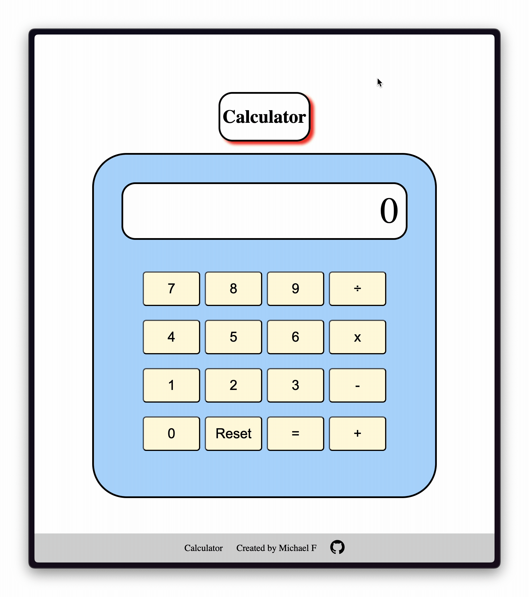
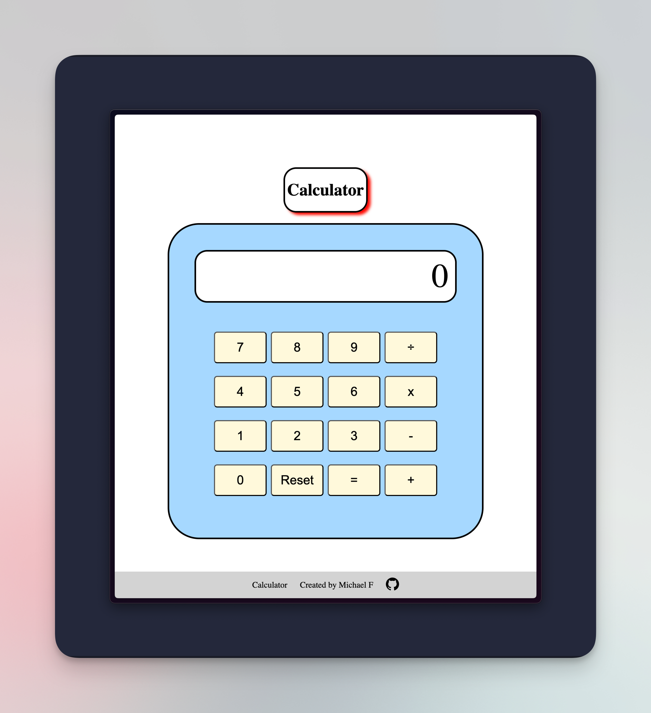

# Calculator

A fully functional interactive integer calculator built with vanilla JavaScript, HTML, and CSS. This calculator supports basic arithmetic operations and features keyboard input support, including keypresses for numbers, operations, and special functions like clear (C/CTRL+C).

## Features

- **Basic Arithmetic Operations**: Addition, subtraction, multiplication, and division.
- **Division by Zero Check**: Prevents errors by displaying a message if division by zero is attempted.
- **Keyboard Support**: Supports both on-screen button clicks and keyboard input.
- **Clear Function**: Use the `C` or `CTRL+C` key to clear the current calculation.
- **Responsive Design**: Fully functional on desktop and mobile devices.

## Demo



## Preview

Here’s what the app looks like:



## Installation

To run the calculator locally, follow these steps:

1. Clone this repository:

    ```bash
    git clone https://github.com/mkforde/web-calculator.git
    ```

2. Open the project folder:

    ```bash
    cd web-calculator
    ```

3. Open the `index.html` file in your browser.

No additional dependencies are required, as this project uses only vanilla JavaScript, HTML, and CSS.

## Usage

- **Clicking**: Simply click the buttons for numbers and operations.
- **Keyboard Input**: You can also use your keyboard for input:
  - Number keys (0-9) for digits
  - `+`, `-`, `*`, `/` for arithmetic operations
  - `Enter` for equals (`=`) to evaluate the expression
  - `C` or `CTRL+C` for clearing the display

The result will appear immediately after pressing Enter. If division by zero is attempted, the display will show an error message.

## Built With

- **JavaScript** (Vanilla) for the functionality and logic
- **HTML5** for the structure
- **CSS3** for styling and layout

## Contributing

If you'd like to contribute to this project, feel free to fork the repository, make changes, and submit a pull request. Issues and suggestions are always welcome!

## Related

This project is the final project of the [The Odin Project Foundation Course](https://www.theodinproject.com/lessons/foundations-calculator). It was built to reinforce core programming concepts in HTML, CSS, and JavaScript.
